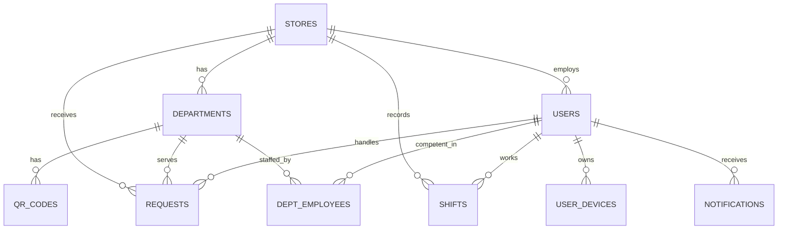

# RetailHub Backend — Техническая документация

## 1. Обзор проекта

**RetailHub** — платформа диспетчеризации консультантов в розничных магазинах.
Клиент сканирует QR-код в отделе → система находит свободного консультанта → отправляет push-уведомление → консультант идёт к клиенту.

### Стек
| Компонент | Технология |
|---|---|
| Язык | Java 25 |
| Фреймворк | Spring Boot 4.0.2 |
| Сборка | Maven (multi-module) |
| БД | PostgreSQL |
| Миграции | Flyway |
| Аутентификация | JWT (JJWT 0.12.6) |
| API-контракт | OpenAPI 3.0 + codegen |
| Тестирование | JUnit 5 + Mockito + AssertJ |

---

## 2. Архитектура модулей

```
diplom/
├── pom.xml                    ← Parent POM (версии, плагины)
├── api-spec/                  ← Модуль генерации API
│   ├── pom.xml                ← openapi-generator-maven-plugin
│   └── openapi.yaml           ← Спецификация (40+ эндпоинтов)
└── app/                       ← Основное Spring Boot приложение
    ├── pom.xml                ← Зависимости, Spring Boot plugin
    └── src/main/java/ru/retailhub/
        ├── RetailHubApplication.java
        ├── auth/              ← Модуль авторизации
        ├── store/             ← Модуль магазинов
        ├── user/              ← Модуль пользователей
        ├── dispatch/          ← Модуль диспетчеризации
        ├── shift/             ← Модуль смен
        └── notification/      ← Модуль уведомлений
```

### Зачем два Maven-модуля?

| Модуль | Назначение |
|---|---|
| `api-spec` | Генерирует Java-интерфейсы (`AuthApi`, `UsersApi`, ...) и DTO (`LoginRequest`, `TokenResponse`, ...) из `openapi.yaml`. Контракт → код, а не наоборот. |
| `app` | Реализует сгенерированные интерфейсы. Содержит бизнес-логику, entity, repositories, конфигурацию. |

**Преимущество:** API-контракт фиксирован. Фронтенд и бэкенд разрабатываются параллельно. Изменения в API видны через diff в `openapi.yaml`.

---

## 3. Модуль авторизации (`auth/`)

### Как работает

```
POST /auth/login   {phone, password}  → { access_token, refresh_token }
POST /auth/refresh {refresh_token}    → { access_token, refresh_token }
GET  /auth/me      [Bearer token]     → { UserProfile }
```

### Компоненты

| Файл | Назначение |
|---|---|
| `JwtProperties` | Конфигурация из `application.yaml`: секрет, TTL токенов |
| `JwtService` | Генерация/валидация JWT. Access (15 мин, subject=userId, claim=role) и Refresh (7 дней, subject=userId) |
| `JwtAuthenticationFilter` | `OncePerRequestFilter`. Извлекает Bearer token → валидирует → устанавливает `SecurityContext` (principal=userId, authority=ROLE_*) |
| `SecurityConfig` | Stateless, без сессий. BCrypt. Публичные: login, refresh, QR scan, Swagger |
| `AuthService` | Бизнес-логика: проверка пароля, маппинг User → UserProfile DTO |
| `AuthController` | `implements AuthApi` — тонкий слой, делегирует в `AuthService` |
| `GlobalExceptionHandler` | `AuthException` → HTTP 401 + `ErrorResponse` DTO |

### Безопасность

- **Пароли:** BCrypt (cost factor 10)
- **Access-токен:** 15 минут, содержит `userId` + `role`
- **Refresh-токен:** 7 дней, содержит только `userId`, не принимается как access
- **Публичные эндпоинты:** `/auth/login`, `/auth/refresh`, `/qr-codes/scan/**`, `POST /requests`, Swagger UI

---

## 4. Модель данных

### ER-Диаграмма



### Таблицы

| Таблица | Entity | Описание |
|---|---|---|
| `stores` | `Store` | Магазин — корень multi-tenant архитектуры |
| `departments` | `Department` | Отдел магазина (Электроника, Бытовая техника) |
| `users` | `User` | Сотрудник: MANAGER или CONSULTANT |
| `department_employees` | `DepartmentEmployee` | Матрица компетенций: кто в каких отделах работает |
| `shifts` | `Shift` | Смена: start/stop, привязана к user + store |
| `qr_codes` | `QrCode` | Физическая точка входа, публичный token ≠ id |
| `requests` | `ServiceRequest` | Заявка на обслуживание (CREATED → ASSIGNED → COMPLETED) |
| `user_devices` | `UserDevice` | FCM-токен устройства для push |
| `notifications` | `Notification` | In-app уведомление (title, body, is_read) |

### Ключевые решения

- **UUID первичные ключи** — нет автоинкрементных id, безопасно при масштабировании
- **LAZY fetch** на всех связях — не тянем лишнее из БД
- **DepartmentEmployee как отдельная entity** — хранит `assigned_at`, а не простой `@ManyToMany`
- **`client_session_token`** в requests — клиент без авторизации следит за заявкой по одноразовому UUID

---

## 5. Flyway-миграции

| Миграция | Содержание |
|---|---|
| `V1` | `stores`, `departments` + индексы |
| `V2` | `users`, `department_employees` + уникальные ограничения |
| `V3` | `shifts`, `qr_codes`, `requests` + индексы для диспетчеризации |
| `V4` | `user_devices`, `notifications` + индекс непрочитанных |

Файлы: `app/src/main/resources/db/migration/V1__*.sql` — `V4__*.sql`

---

## 6. Тестирование

### Покрытие

| Тестовый класс | Тестов | Что проверяет |
|---|---|---|
| `JwtServiceTest` | 12 | Генерация, валидация, извлечение данных, типы токенов, поддельные секреты |
| `AuthServiceTest` | 7 | Login (успех, неверный телефон, неверный пароль), Refresh (успех, невалидный, access вместо refresh), getCurrentUser |
| `AuthControllerTest` | 5 | HTTP-контракт: POST /auth/login (200/401), POST /auth/refresh (200/401), GET /auth/me (200) |
| `RetailHubApplicationTests` | 1 | Context loads |
| **Итого** | **26** | **0 failures** |

### Запуск тестов

```bash
./mvnw test -pl app -am "-Dopenapi.spec.path=file:///C:/_Diplom/diplom/api-spec/openapi.yaml"
```

---

## 7. Сборка и запуск

### Требования
- JDK 25+
- Maven (через `mvnw.cmd`)
- PostgreSQL (для runtime, не для тестов)

### Компиляция
```bash
$env:JAVA_HOME='C:\Program Files\Java\jdk-25.0.2'
.\mvnw.cmd compile "-Dopenapi.spec.path=file:///C:/_Diplom/diplom/api-spec/openapi.yaml"
```

### Конфигурация
Файл `app/src/main/resources/application.yaml`:
- **JWT:** `app.jwt.secret` — сменить в продакшне!
- **БД:** раскомментировать `spring.datasource.*` когда PostgreSQL поднят
- **Swagger UI:** `http://localhost:8080/swagger-ui.html`
